# HelpDeskLite - Integración Continua CI y Entrega Continua CD

## Integrantes

| Nombre completo |
|---|
| Mateo González Escudero |
| Juan David Álvarez Ramírez |
| Jessica Johanna Obando García |
| Lukas Jiménez Bueno |

---

## Videos de evidencia

Los videos de sustentación del proyecto se encuentran disponibles en el siguiente enlace:

[Ver videos de evidencia CI/CD en SharePoint](https://correoitmedu-my.sharepoint.com/:f:/g/personal/mateogonzalez223620_correo_itm_edu_co/IgD5mdqHe5ytRJenpMo-dpkKAV_vwVUblPVhUSCN78bs6Ns?e=vCIBo2)

### Contenido de los videos

| Video | Descripción |
|---|---|
| Video 1 - Integración Continua CI | Se evidencia el repositorio en GitHub, el archivo `azure-pipelines.yml`, la ejecución automática del pipeline, la compilación de la aplicación y la generación del artefacto `drop`. |
| Video 2 - Entrega Continua CD | Se evidencia el despliegue automático hacia Azure App Service, la ejecución de la etapa CD y la validación de la aplicación publicada en Azure. |

---
# HelpDeskLite - Integración Continua CI y Entrega Continua CD

## 1. Descripción general

**HelpDeskLite** es una aplicación web desarrollada en **ASP.NET Core Razor Pages** para la gestión básica de tickets de soporte técnico.

El objetivo principal del proyecto es demostrar un flujo DevOps completo utilizando:

- GitHub como repositorio de código fuente.
- Azure DevOps para Integración Continua y Entrega Continua.
- Azure Pipelines para compilar, publicar y generar artefactos.
- Azure App Service como entorno de despliegue en la nube.

La aplicación permite:

- Crear tickets de soporte.
- Listar tickets.
- Editar tickets.
- Ver detalles.
- Eliminar tickets.
- Cambiar el estado de los tickets.
- Consultar el endpoint `/health`.
- Consultar el endpoint `/api/tickets`.

---

## 2. Tecnologías utilizadas

- Visual Studio 2022
- ASP.NET Core Razor Pages
- .NET 9
- C#
- Git
- GitHub
- Azure DevOps
- Azure Pipelines
- Azure App Service

---

## 3. Repositorio del proyecto

Repositorio GitHub:

```text
https://github.com/Matgon9510/helpdesk-lite-ci-cd
```

Rama principal utilizada:

```text
main
```

---

## 4. URL de la aplicación publicada

La aplicación fue publicada en Azure App Service:

```text
https://helpdesklite20260520.azurewebsites.net
```

Rutas principales de validación:

```text
https://helpdesklite20260520.azurewebsites.net/
https://helpdesklite20260520.azurewebsites.net/Tickets
https://helpdesklite20260520.azurewebsites.net/health
https://helpdesklite20260520.azurewebsites.net/api/tickets
```

---

## 5. Estructura general del proyecto

```text
HelpDeskLite
│
├── Models
│   └── Ticket.cs
│
├── Services
│   └── TicketService.cs
│
├── Pages
│   ├── Index.cshtml
│   ├── Index.cshtml.cs
│   └── Tickets
│       ├── Index.cshtml
│       ├── Index.cshtml.cs
│       ├── Create.cshtml
│       ├── Create.cshtml.cs
│       ├── Edit.cshtml
│       ├── Edit.cshtml.cs
│       ├── Details.cshtml
│       ├── Details.cshtml.cs
│       ├── Delete.cshtml
│       └── Delete.cshtml.cs
│
├── Program.cs
├── azure-pipelines.yml
├── appsettings.json
└── README.md
```

---

## 6. Funcionamiento de la aplicación

La aplicación funciona mediante un servicio en memoria llamado `TicketService`.

Inicialmente se evaluó utilizar base de datos con SQL Server y Entity Framework Core. Sin embargo, se decidió simplificar la solución, ya que el objetivo principal de la práctica es demostrar el flujo DevOps de CI/CD, generación de artefactos y despliegue automatizado.

El servicio `TicketService` permite:

- Obtener todos los tickets.
- Obtener un ticket por ID.
- Crear tickets.
- Actualizar tickets.
- Cambiar estado.
- Eliminar tickets.
- Calcular totales para el dashboard.

### Evidencia de funcionamiento local

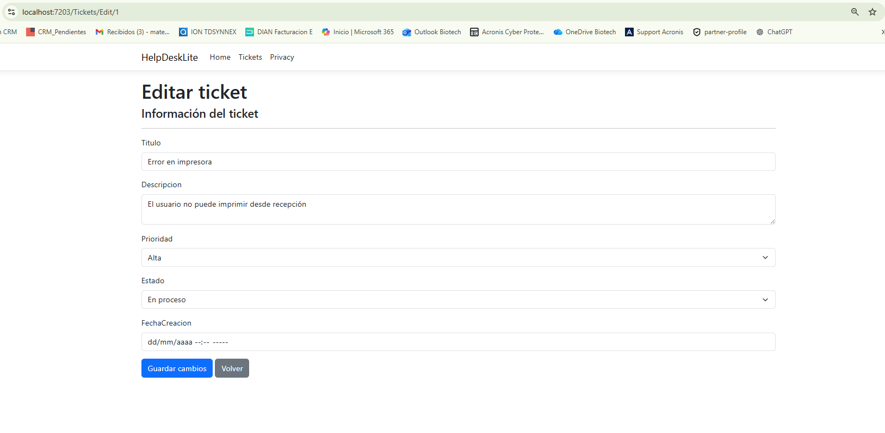

---

## 7. Configuración de Azure App Service

La aplicación fue desplegada en Azure App Service, usando una suscripción académica de Azure for Students.

Durante el proceso se validó el plan de hospedaje y la creación del servicio web.

### Creación del App Service desde Azure Portal

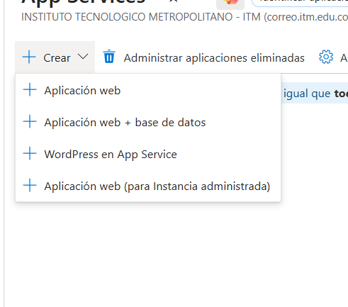

### Validación de App Service Plan F1

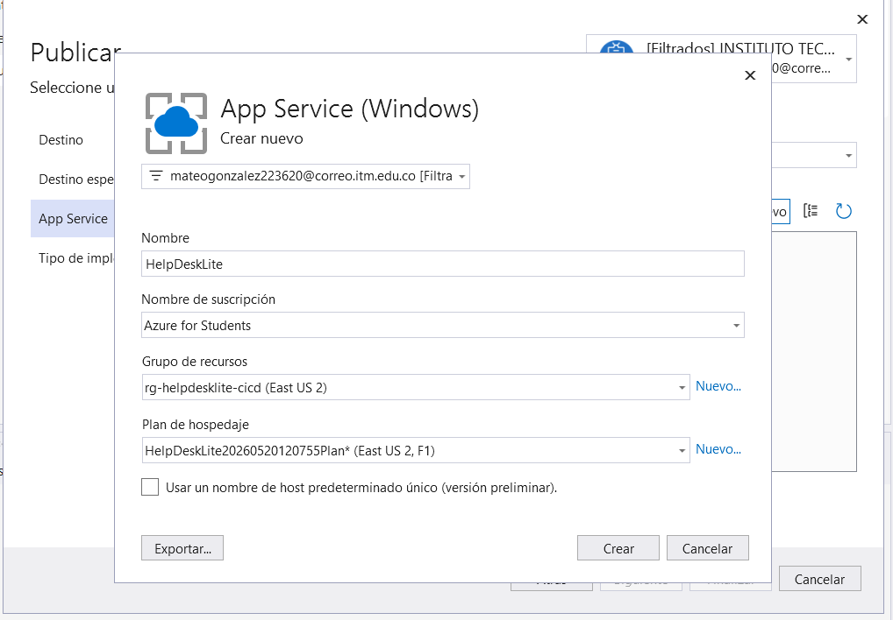

El App Service final utilizado fue:

```text
helpdesklite20260520
```

URL pública:

```text
https://helpdesklite20260520.azurewebsites.net
```

---

## 8. Control de versiones con GitHub

El proyecto fue versionado usando Git y publicado en GitHub.

Comandos utilizados durante el proceso:

```powershell
git init
git add .
git commit -m "Creación inicial de HelpDeskLite"
git remote add origin https://github.com/Matgon9510/helpdesk-lite-ci-cd.git
git push -u origin main
```

También se realizaron commits posteriores para validar el flujo automático:

```powershell
git add .
git commit -m "Actualiza título para validar CI CD automático"
git push
```

Al hacer `push` sobre la rama `main`, Azure DevOps ejecuta automáticamente el pipeline.

---

## 9. Integración Continua CI

La Integración Continua fue configurada mediante Azure DevOps y el archivo:

```text
azure-pipelines.yml
```

El pipeline se activa automáticamente con cambios en la rama principal:

```yaml
trigger:
- main
```

La etapa de CI realiza las siguientes tareas:

- Instalar .NET SDK 9.
- Restaurar dependencias.
- Compilar la aplicación.
- Publicar la aplicación.
- Comprimir la aplicación publicada.
- Publicar el artefacto `drop`.

### Evidencia de pipeline CI exitoso

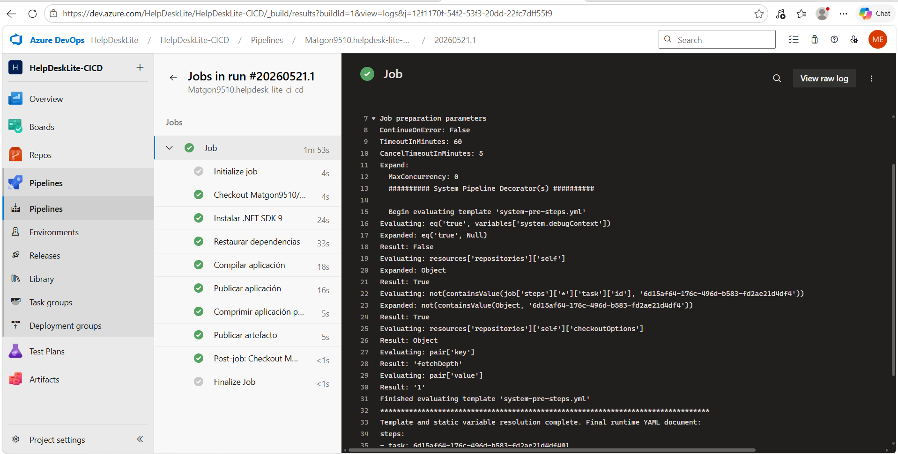

---

## 10. Generación de artefacto

Al finalizar la etapa de CI, Azure DevOps genera un artefacto llamado:

```text
drop
```

Este artefacto contiene el paquete comprimido de la aplicación:

```text
HelpDeskLite.zip
```

Este archivo es utilizado posteriormente por la etapa de Entrega Continua para desplegar la aplicación en Azure App Service.

---

## 11. Entrega Continua CD

La Entrega Continua fue configurada dentro del mismo archivo `azure-pipelines.yml`.

La etapa de CD realiza las siguientes acciones:

- Descarga el artefacto `drop`.
- Toma el archivo `HelpDeskLite.zip`.
- Despliega la aplicación en Azure App Service.
- Actualiza automáticamente la aplicación publicada.

La tarea principal utilizada para el despliegue es:

```text
AzureWebApp@1
```

### Configuración de despliegue hacia Azure App Service

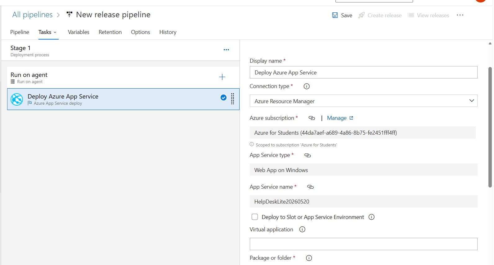

---

## 12. Flujo final CI/CD

El flujo DevOps implementado es:

```text
GitHub
  ↓
Azure DevOps Pipeline
  ↓
Integración Continua CI
  ↓
Artefacto drop
  ↓
Entrega Continua CD
  ↓
Azure App Service
```

### Evidencia del pipeline completo exitoso

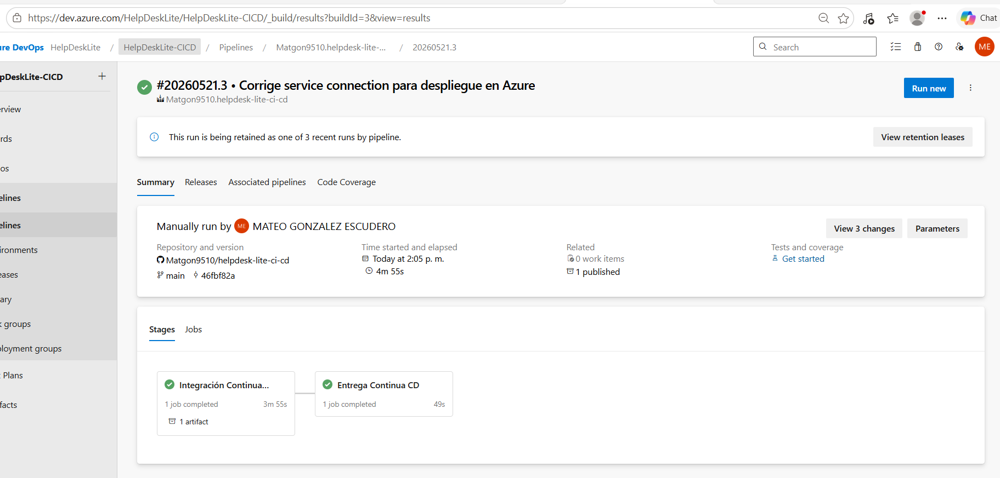

En esta evidencia se observa que las dos etapas finalizaron correctamente:

```text
Integración Continua CI
Entrega Continua CD
```

---

## 13. Validación del despliegue automático

Para validar el flujo completo, se realizó un cambio visible en la aplicación y se ejecutaron los siguientes comandos:

```powershell
git add .
git commit -m "Actualiza título para validar CI CD automático"
git push
```

Después del `git push`, se verificó que:

1. GitHub recibió el cambio.
2. Azure DevOps ejecutó la etapa CI.
3. Se generó el artefacto `drop`.
4. Azure DevOps ejecutó la etapa CD.
5. La aplicación publicada en Azure mostró el cambio aplicado.

Esto confirma que el despliegue se realiza de forma automática desde Azure DevOps hacia Azure App Service.

---

## 14. Errores encontrados y soluciones aplicadas

Durante la implementación se presentaron varios errores, los cuales fueron corregidos durante el desarrollo del proyecto.

---

### Error 1: Problemas iniciales con Entity Framework Core

Durante la implementación inicial con base de datos se presentaron errores relacionados con Entity Framework Core y los paquetes de SQL Server.

Uno de los errores fue que el proyecto no reconocía elementos como:

```text
DbContext
DbSet
UseSqlServer
```

### Causa

El proyecto no tenía instalados o alineados correctamente los paquetes de Entity Framework Core.

### Solución

Se instalaron y ajustaron los paquetes necesarios para la versión del proyecto. Posteriormente, debido a que la base de datos no era un requisito obligatorio para la práctica, se decidió retirar Entity Framework Core y simplificar la aplicación usando almacenamiento en memoria.

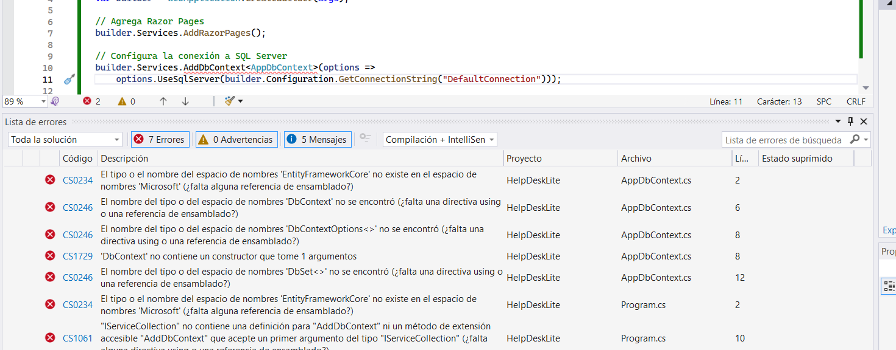

---

### Error 2: Error por dependencia antigua de AppDbContext

Después de retirar la base de datos, algunas páginas seguían referenciando `AppDbContext`.

El error se relacionaba con referencias como:

```text
HelpDeskLite.Data.AppDbContext
```

### Causa

Algunas páginas generadas anteriormente por scaffolding todavía dependían de la base de datos.

### Solución

Se reemplazó el uso de `AppDbContext` por `TicketService`, dejando la aplicación funcionando sin base de datos.

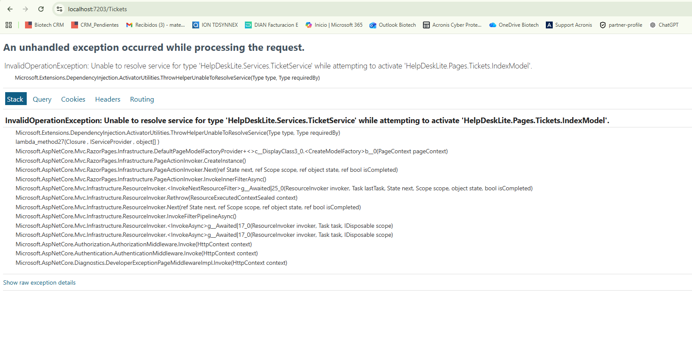

---

### Error 3: Restricción de regiones en Azure for Students

Al intentar crear recursos en Azure apareció un error de política relacionado con regiones permitidas.

### Causa

La suscripción Azure for Students tenía restricciones para desplegar recursos en ciertas regiones.

### Solución

Se seleccionó una región y un plan compatibles con la suscripción. También se evitó crear recursos adicionales innecesarios, como Azure SQL Database.

---

### Error 4: Agente no encontrado en Release clásico

Durante una prueba con Release clásico apareció el error:

```text
No image label found to route agent pool Hosted Windows 2019 with VS2019
```

### Causa

El Release clásico intentaba usar una imagen antigua de agente hospedado.

### Solución

Se ajustó el proceso para utilizar un pipeline YAML moderno con agente:

```text
windows-latest
```

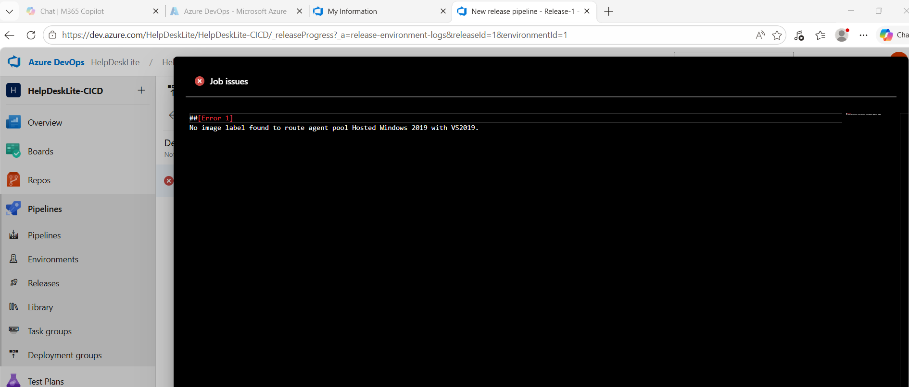

---

### Error 5: Pipeline fallido por Service Connection

El pipeline falló inicialmente al intentar desplegar en Azure App Service.

El error indicaba que la conexión de servicio no existía o no estaba autorizada.

### Causa

El nombre configurado en el archivo `azure-pipelines.yml` no coincidía con el nombre real de la Service Connection.

### Solución

Se configuró correctamente la Service Connection y se actualizó el YAML con el nombre:

```text
sc-azure-helpdesklite
```

Después de este ajuste, el pipeline ejecutó correctamente la etapa de CD.

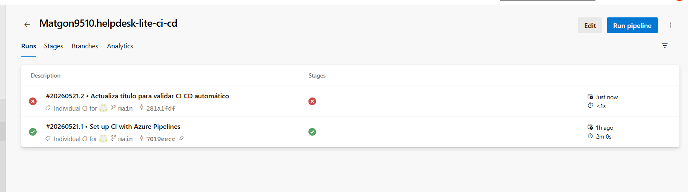

---

### Error 6: Pipeline listado con error antes de corrección

Antes de corregir la Service Connection, el run del pipeline aparecía en rojo.

### Solución

Se corrigió el nombre de la conexión de servicio en el YAML y se volvió a ejecutar el pipeline.

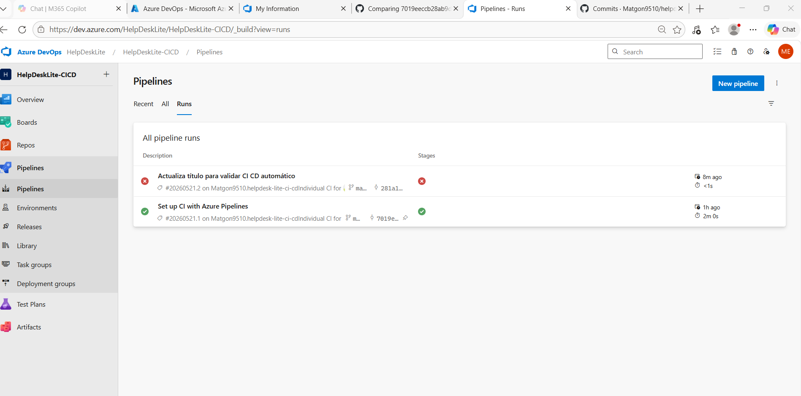

---

## 15. Archivo azure-pipelines.yml

El pipeline final contiene dos etapas principales:

```text
Integración Continua CI
Entrega Continua CD
```

La estructura general del archivo es:

```yaml
trigger:
- main

pool:
  vmImage: 'windows-latest'

variables:
  buildConfiguration: 'Release'
  webAppName: 'helpdesklite20260520'
  azureSubscription: 'sc-azure-helpdesklite'

stages:
- stage: Build
  displayName: 'Integración Continua CI'

- stage: Deploy
  displayName: 'Entrega Continua CD'
```

La primera etapa compila y genera el artefacto.  
La segunda etapa despliega el artefacto en Azure App Service.

---

## 16. Videos de evidencia

Se entregan dos videos:

### Video 1 - Integración Continua CI

Este video evidencia:

- Proyecto en Visual Studio.
- Repositorio en GitHub.
- Archivo `azure-pipelines.yml`.
- Commit y push a la rama `main`.
- Ejecución automática de CI.
- Compilación correcta.
- Generación del artefacto `drop`.

### Video 2 - Entrega Continua CD

Este video evidencia:

- Aplicación publicada en Azure App Service.
- Cambio visible en la aplicación.
- Commit y push a GitHub.
- Ejecución de CI.
- Ejecución de CD.
- Aplicación actualizada automáticamente en Azure.

---

## 17. Resultado final

El proyecto quedó con un flujo DevOps funcional:

```text
GitHub → Azure DevOps CI → Artefacto drop → Azure DevOps CD → Azure App Service
```

Resultado final:

```text
Aplicación publicada y actualizada automáticamente en Azure App Service.
```

URL final:

```text
https://helpdesklite20260520.azurewebsites.net
```

---

## 18. Conclusión

La implementación permitió demostrar un flujo completo de Integración Continua y Entrega Continua utilizando GitHub, Azure DevOps y Azure App Service.

La aplicación HelpDeskLite funciona como una solución web básica para la gestión de tickets de soporte. Cada cambio enviado a la rama `main` activa automáticamente el pipeline, genera el artefacto y despliega la aplicación en Azure, cumpliendo el objetivo principal de la práctica DevOps.
